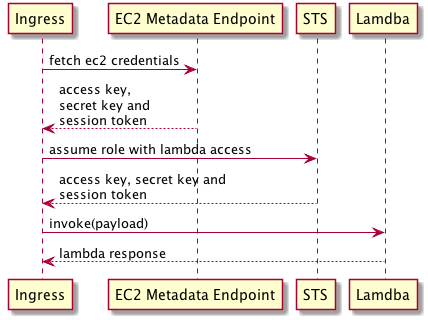

# InvokeLambda

## Development

### Get the dependencies!
`mix deps.get`

### Run the tests!
`mix test`

### Usage

To invoke a lambda from EC2, this requires:
- Lambda function name
- Instance role name for the credentials
- Lambda role arn for the EC2 to assume and retrieve further credentials
- Payload to send to the lambda

```elixir
InvokeLambda.invoke("lambda-function-name", %{
  instance_role_name: "instance-role-name",
  lambda_role_arn: "lambda-role-arn",
  function_payload: %{function: "payload"}
})
```

## Details

### Terms

| Term | Definition |
| --- | --- |
| Canonical request | The original base request |
| Metadata | Other headers of parameters used in the hashing or signing |
| Signature | Added as authorisation token |
| Presigned url | A request with a query string as the signature |
| Signed request | A request with headers as the signature |
| Request hash digest | Signs the canonical request |
| String to sign | This includes the date, the canonical request and some other metadata |
| Signature Version 4 | This is the default used by all AWS services, except SimpleDB which used V2. V4 is recommended for all services as supported by all new services and regions. |

### How this works

The invoker follows these steps:
- Gets the credentials from the EC2 instance by using the metadata endpoint.
- Assumes the lambda role using the credentials.
- Invokes the lambda with the credentials it has received from the role.



When retrieving the instance credentials, the metadata endpoint is called using the instance role name.

> http://169.254.169.254/latest/meta-data/iam/security-credentials/{role-name}

The response is parsed and the AccessKeyId. SecretAccessKey and Token are used.

When signing, a hash of headers should be added to the request:
- host
- x-amz-date
- x-amz-security-token
- x-amz-content-sha256
- authorization

### More information
- Background for signing requests:
https://docs.aws.amazon.com/general/latest/gr/signing_aws_api_requests.html
- How AWS signs and authenticates requests:
https://docs.aws.amazon.com/AmazonS3/latest/dev/RESTAuthentication.html
- V4 signature:
https://docs.aws.amazon.com/general/latest/gr/signature-version-4.html
